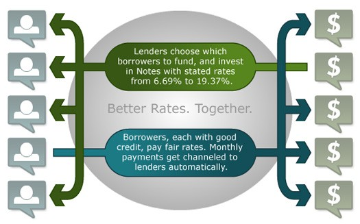

# Credit-Modeling
Modeling a borrower's [credit risk](https://en.wikipedia.org/wiki/Credit_risk)
### **Problem Statement**
Can we build a machine learning model that can accurately predict if a borrower will pay off their loan on time or not?

I'll be working with financial lending data from [Lending Club](https://www.lendingclub.com/).Lending Club is a marketplace for personal loans that matches borrowers who are seeking a loan with investors looking to lend money and make a return.

Each borrower fills out a comprehensive application, providing their past financial history, the reason for the loan, and more. Lending Club evaluates each borrower's credit score using past historical data (and their own data science process!) and assign an interest rate to the borrower.

A higher interest rate means that the borrower is riskier and more unlikely to pay back the loan while a lower interest rate means that the borrower has a good credit history is more likely to pay back the loan. The interest rates range from 5.32% all the way to 30.99% and each borrower is given a grade according to the interest rate they were assigned. If the borrower accepts the interest rate, then the loan is listed on the Lending Club marketplace.

Investors are primarily interested in receiving a return on their investments. Approved loans are listed on the Lending Club website, where qualified investors can browse recently approved loans, the borrower's credit score, the purpose for the loan, and other information from the application. Once they're ready to back a loan, they select the amount of money they want to fund. Once a loan's requested amount is fully funded, the borrower receives the money they requested minus the [origination fee](https://help.lendingclub.com/hc/en-us/articles/214501207-What-is-the-origination-fee-) that Lending Club charges.

The borrower then makes monthly payments back to Lending Club either over 36 months or over 60 months. Lending Club redistributes these payments to the investors.

However, and some borrowers **default** on the loan

**In this project, I'll focus on the mindset of a conservative investor who only wants to invest in the loans that have a good chance of being paid off on time.**
